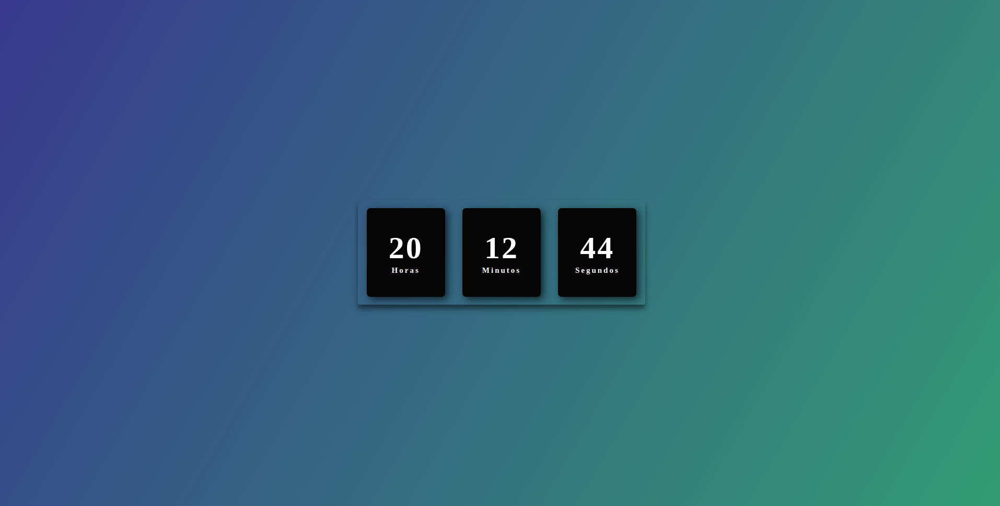

# Relógio digital 
--
 
Esse projeto apresenta um relógio de modelo digital. O JavaScript foi utilizado para deixar o horário atualizado.
  
*Imagem do projeto:*
 

  
Tecnologias utilizadas: 
 HTML
 CSS
JAVASCRIPT

  
Para ver o projeto funcionado clique [AQUI](https://wilgnerfrasao.github.io/relogio/)

